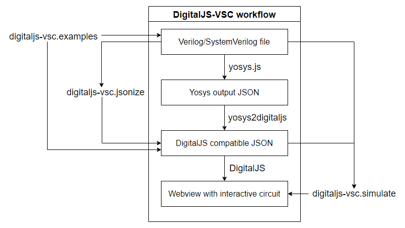

# DigitalJS-VSC

This extension integrates digital logic simulator [DigitalJS](https://github.com/tilk/digitaljs), [yosys2digitaljs](https://github.com/tilk/yosys2digitaljs) converter and [yosys.js](https://github.com/EDAcation/yosys.js) (WebAssembly version of [Yosys](https://github.com/YosysHQ/yosys)) with Visual Studio Code.

It is designed to simulate circuits written in Verilog, SystemVerilog and DigitalJS compatible json and let users interact with them within a Webview.

DigitalJS-VSC attempts to mirror feature set of web application [digitaljs_online](https://github.com/tilk/digitaljs_online) within Visual Studio Code. You can try out the original web application [here](https://digitaljs.tilk.eu/).

## Available commands
DigitalJS-VSC contributes following commands:
* `digitaljs-vsc.simulate` – opens/updates a webview panel with circuit simulation from Verilog, SystemVerilog or DigitalJS compatible json file that is currently active.
* `digitaljs-vsc.jsonize` – opens a new tab with DigitalJS compatible json generated from Verilog or SystemVerilog file that is currently active. File is opened and is not automatically saved on the user's disk. If you wish to preserve generated json or run command `digitaljs-vsc.simulate` on it, please save the generated json file manually.
* `digitaljs-vsc.examples` – opens a folder (workspace) with predefined .sv and DigitalJS compatible .json examples ready to interact with DigitalJS-VSC functionalities. Warning: executing this command will replace currently opened workspace. Examples will not restore themselves to the original form if overridden.

Commands can be run via `Shift+Ctrl+P` (Windows, Linux) or `Shift+CMD+P` (macOS) and are labeled as `DigitalJS-VSC`.

## Extension workflow

## Notes regarding the panel

* Only one circuit will be simulated at any given moment. Running `digitaljs-vsc.simulate` on a different file than the one currently being simulated will replace the current panel and refresh the webview with new input in a position relative to the column of the new source file.
* The panel with circuit simulation will run in the background even when not active or visible to allow switching between the files, e.g. with the source code.
It is recommended to manually close the panel when the simulation is no longer needed.
* Exiting Visual Studio Code with opened panel will automatically close it and the panel will not be restored after opening the editor again.
* Webview with the simulation by default will appear in the column beside the source file to allow interaction while still seeing the source code. It can be changed to be spawned within the same column, e.g. for full screen usage via settings. Once running, the webview can be freely moved between the columns and will automatically swap columns only after running `digitaljs-vsc.simulate` again.

## Extension Settings

DigitalJS-VSC contributes following settings:
* `digitaljs-VSC.spawnInTheSameColumn` – controls whether DigitalJS panel will appear in the column beside the source file (`false`) or within the same column as the source file (`true`). It is disabled by default.
* `digitaljs-VSC.optimizeInYosys` – enables Yosys optimization of the synthesized circuit ('opt -full'). This might make the circuit differ significantly from its HDL specification. It is disabled by default.
* `digitaljs-VSC.simplifyDiagram` – controls activation of post-processing of Yosys output to reduce the number of components and improve the readability. It is enabled by default.
* `digitaljs-VSC.layoutEngine` – changes how the circuit elements are automatically positioned after synthesis. Options: `"ElkJS"` (more readable, default), `"Dagre"` (legacy).
* `digitaljs-VSC.simulationEngine` – changes how the synthesized circuit is simulated. Options: `"WebWorker"` (default), `"Synchronous"`. The synchronous engine is well tested, but slower in comparison to WebWorker.
* `digitaljs-VSC.experimentalFsmTransform` – controls finite state machine processing in Yosys. This corresponds to the `'fsm'` and `'fsm -nomap'` Yosys commands. Options: `"Disabled"` (default), `"Enabled"`, `"AsCircuitElement"`.
* `digitaljs-VSC.mergeMoreLogicIntoFsm` – enables usage of `'-expand'` for `fsm` within Yosys. Disabled by default. Works only if Fsm Transform option is not set to `Disabled`.

Altering settings does not require extension/editor reset, but it will take effect only after generation/update of the panel. Running next command will apply new settings automatically.

## Requirements

DigitalJS-VSC is designed not to require any setting up before the usage.

## License notes

* All .json examples were sourced from [here](https://github.com/tilk/digitaljs/tree/master/examples) and are subjects to `Copyright 2018 Marek Materzok` under BSD 2-Clause. See also `./examples/json/LICENSE`.
* All .sv examples were sourced from [here](https://digitaljs.tilk.eu) and are subjects to `Copyright 2018 Marek Materzok` under BSD 2-Clause. See also `./examples/sv/LICENSE`.
* File `src/index.js` which provides DigitalJS API to the webview was partially sourced from [here](https://github.com/tilk/digitaljs/blob/master/examples/template.html), further modified and extended and is subject to `Copyright 2018 Marek Materzok` under BSD 2-Clause. See also information included in the comment within the file.
* DigitalJS logo (displayed in extension marketplace, within the webview and in webview panel title) was designed by `Marek Materzok` and is subject to `Copyright 2018` under BSD 2-Clause. It is sourced from [here](https://github.com/tilk/digitaljs_online/blob/master/public/android-chrome-512x512.png), see also `./media/img/logo/LICENSE`. Smaller version of the logo is being loaded onto the webview directly from [here](https://github.com/tilk/digitaljs_online/blob/master/public/android-chrome-192x192.png).

## Technical notes

* DigitalJS-VSC uses fixed version of yosys2digitaljs (0.5.0), as it is strictly dependent on patch file with diff that it applies to modify original yosys2digitaljs to use yosys.js output file directly instead of running yosys.
* DigitalJS-VSC uses fixed version of yosys.js (0.10.5), as its API might dynamically change.

## Known Issues

## Release Notes

### 0.1.0

Initial release of DigitalJS-VSC

-----------------------------------------------------------------------------------------------------------
